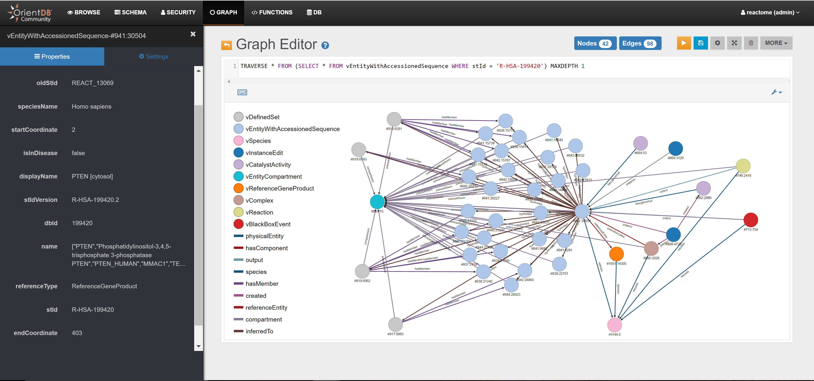
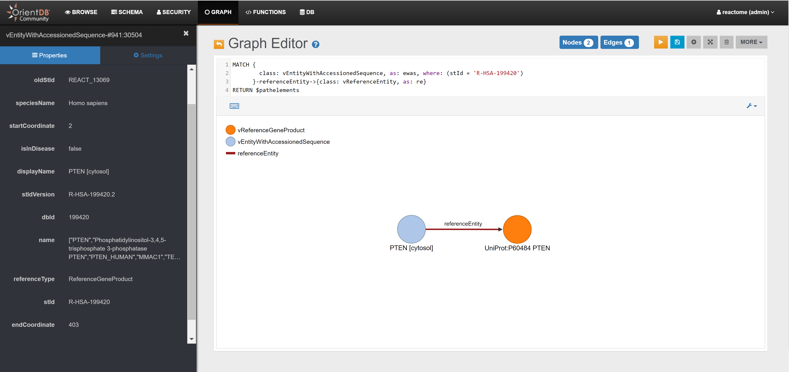
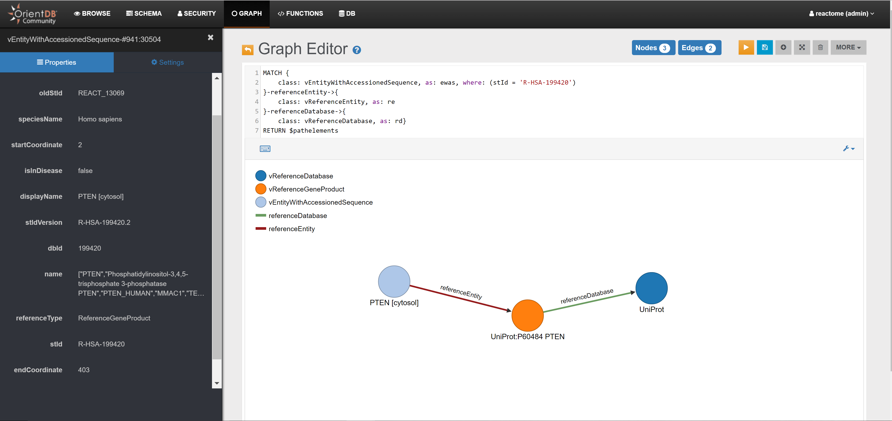

# reactome-orientdb


## Introduction

Hello and welcome to the reactome-orientdb repository!

The aim of this repository is to make the [Reactome](http://reactome.org/) database available as a graph in OrientDB, the Graph/Document Multi-Model Database

We have imported the [Reactome graph database](http://reactome.org/pages/documentation/developer-guide/graph-database/) into OrientDB using the [Neo4j to OrientDB Importer](http://orientdb.com/neo4j-to-orientdb-importer/), and then optimized the Reactome structure for OrientDB

The reactome database is updated every 3-4 months. To start with, please select the branch related to your Reactome version (e.g. 59): you will be able to download directly the migrated database

Note: not all versions may have been imported into OrientDB - but you can perform the migration yourself 

Please open an issue if you have any questions or problems

Many thanks,

## Using a migrated version

To use a version of the Reactome database that has been migrated already to OrientDB:

- Download the `reactome.zip` archive from one of the branches of this repository (identify the one corresponding to your database version, if it exists)
- Unzip `reactome.zip` into the `databases` directory of your OrientDB installation


## High-level migration steps

Step 1: [Download](http://www.reactome.org/download/current/reactome.graphdb.tgz) the Neo4j version of Reactome

Step 2: Download and install [OrientDB](http://orientdb.com/download/) and the [Neo4j to OrientDB Importer](http://orientdb.com/neo4j-to-orientdb-importer/), e.g.

```
$ wget http://mkt.orientdb.com/CE-2216-multiOS -O orientdb-community-2.2.16.zip
$ unzip orientdb-community-2.2.16

$ wget http://mkt.orientdb.com/importer-2216-tar -O orientdb-neo4j-importer-2.2.16.tar.gz
$ tar xfv orientdb-neo4j-importer-2.2.16.tar.gz -C orientdb-community-2.2.16 --strip-components=1
```

Step 3: Migrate the database from Neo4j to OrientDB with a command similar to the following:

```
$ ./orientdb-neo4j-importer.sh \
    -neo4jlibdir /home/santo/neo4j/neo4j-community-3.0.7/lib \          
    -neo4jdbdir /home/santo/neo4j/data/reactome.graphdb \
    -odbdir /home/santo/orientdb/orientdb-community-2.2.16/databases/reactome \    
```

Step 4: Optimize the structure of the Reactome database in OrientDB by applying the list of SQL statements included in the file `optimize_reactome_orientdb.osql`, e.g. using the OrientDB console:

```
$ ./console.sh optimize_reactome_orientdb.osql
```

Note: if you are using OrientDB 2.2.16 or below, before executing the above command please open `console.sh` and change the value of the `-Xmx512m` parameter to `-Xmx1024m`. Starting with OrientDB 2.2.17 we have raised this by default, so this step won't be necessary

Step 5: Start an OrientDB server:

```
$ ./server.sh
```

Step 6: Point your browser to `http://localhost:2480` and connect to the reactome database using user `admin` and password `admin`




## Querying the Reactome DB

Some query examples are reported below (please execute them from the "Graph Editor" Tab)

### Retrieving objects based on their identifier

Example #1

```
MATCH {class: vpathway, as: pathway, where: (stId = 'R-HSA-1236975')}
RETURN $pathelements
```

Example #2

```
MATCH {class: vEntityWithAccessionedSequence, as: ewas, where: (stId = 'R-HSA-199420')}
RETURN $pathelements
```

### Querying vertices connected by specific edges types

Example #1


```
MATCH {class: vEntityWithAccessionedSequence, as: ewas, where: (stId = 'R-HSA-199420')}-referenceEntity->{class: vReferenceEntity, as: re}
RETURN $pathelements
```



Example #2

```
MATCH {
	   class: vEntityWithAccessionedSequence, as: ewas, where: (stId = 'R-HSA-199420')
	  }-referenceEntity->{
	   class: vReferenceEntity, as: re
	  }-referenceDatabase->{
	   class: vReferenceDatabase, as: rd}
RETURN $pathelements
```


